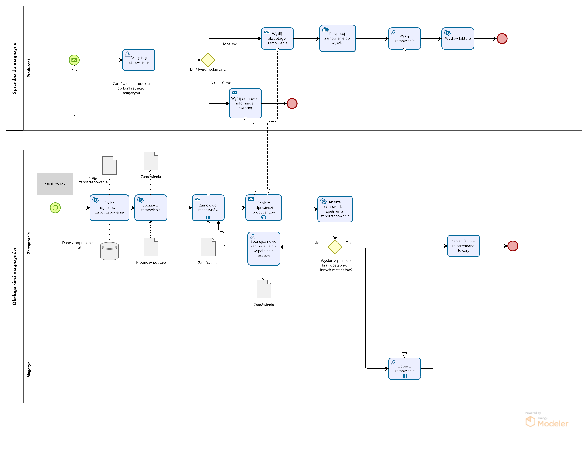
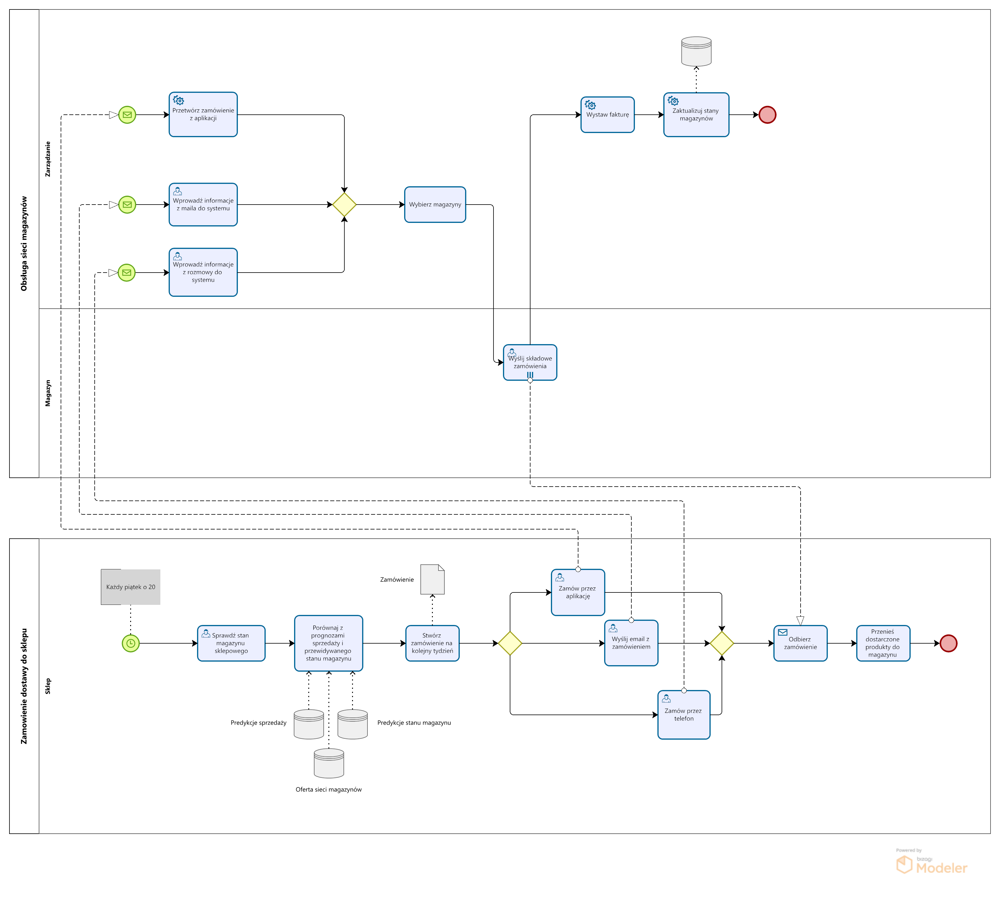

# wsyz-projekt

## BPMN

Do rozważenia: 
- Ciągłe aktualizowanie prognozowanej sprzedaży i ilości produktów przechowywanych w magazynie przysklepowym. W zadaniu optymalizacyjnym zakładana ona jest z góry na cały rok, ale realnie chyba takie rzeczy powinno się aktualizować?
- Taski liczące rzeczy przed stworzeniem czegoś jak faktura czy zamówienie. Chyba nie są potrzebne bo to się zawiera w "wystawianiu"?
Do zrobienia:
- Zmienić komunikację sklep-sieć magazynów żeby odzwierciedlała różne metody komunikacji (email, telefon, apka). Klient przed komunikacją wybiera jeden z nich, i to aktywuje oddzielną gałąź w Obsłudze sieci, które łączą się przy wysyłce albo chwile wcześniej